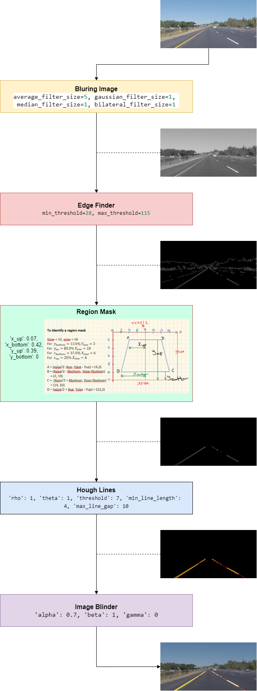
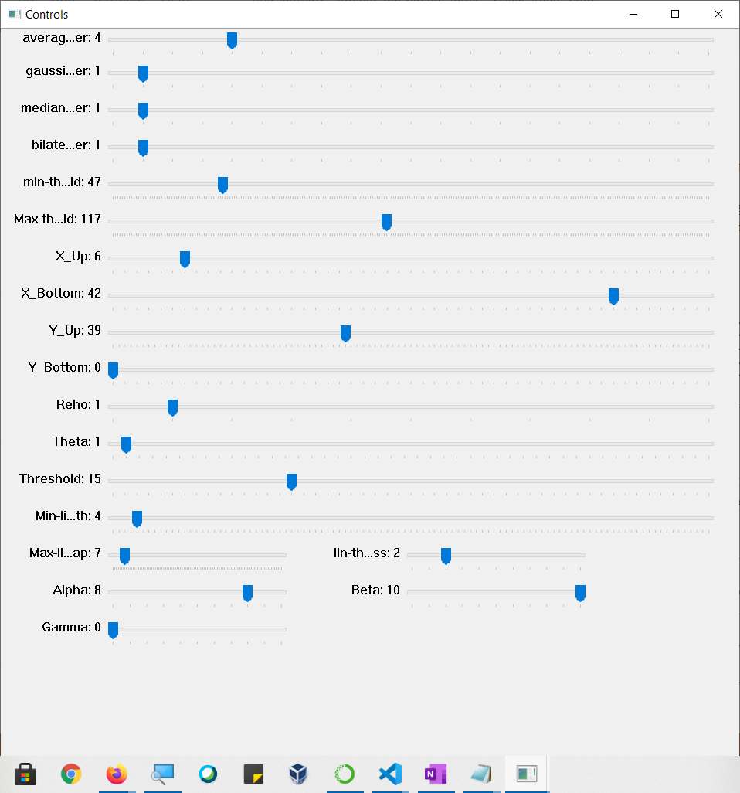
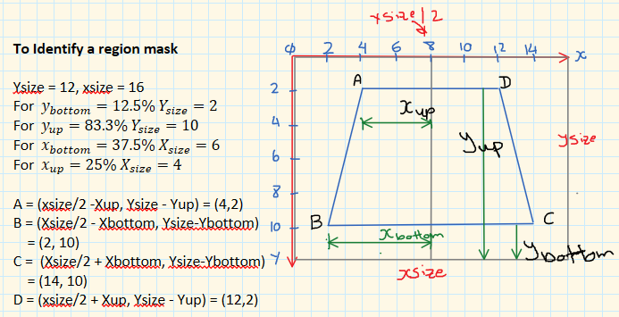

# opencv-gui-pipline-tuner
Building a GUI tool to construct and tune a pipeline for applying identifications of lane lines in images an/or videos.

## Introduction.
During my study in the self-driving cars nanodegree, I came across [an article][1] that describes a tool to tune the different parameters for the different image processing steps that construct a pipeline of steps or tools in which each step is applying a certain functional after tuning it with its parameters.

The steps are color selection, region of interest selection, grayscaling, Gaussian smoothing, Canny Edge Detection and Hough Tranform line detection.

I started from this tool and built on the idea to have a GUI for tuning each step of the pipeline and you can even build your own pipeline. Here is a video to explain the tool.

[][2]

## The Design
The highlevel design diagram for the tool is depending on constructing a pipeline of different processors. Each processor is having an image as input and image as output. The input of one processor is the output of the previous processor of the chain as explained in the diagram below:


In each step we modify a set of parameters to show the outcome of each step. I created a library that creates a GUI for these parameters for each step to be able to control them through a control panel.

The control panel with each parameters set is shown beow 



In the following I will try to explain only the step that I created a new idea about it as an 

## Mask Region Processor

In this processor, we are using for values to identiy a polygonal shape to be the masked area. The below diagram explains the idea about how we convert the numbers of x-up, x-down, y-up, and y-down to be able to draw and modify the polygonal



> ** NOTE ** please note that the values of x-up, x-down, y-up, and y-down, are all percentages of the original 

## The Tool Usage

To use the tool you need to active an enviroment that has the OpenCV already installed.

There are two different ways to use the tool, One to use the find lane pipeline in an image, and another tool for using it with a video as follows:

```
(carnd-term1-38) \opencv-gui-pipline-tuner> python .\find_lanes_pipeline.py -h
usage: find_lanes_pipeline.py [-h] [-c CONFIG_FILE] [-o OUTPUT_FOLDER] [-d] filename

Visualizes the different stages for image processing pipelines and control the needed parameters.

positional arguments:
  filename              Input file either text, image or video

optional arguments:
  -h, --help            show this help message and exit
  -c CONFIG_FILE, --config CONFIG_FILE
                        a JSON file to load the initial configuration
  -o OUTPUT_FOLDER, --out OUTPUT_FOLDER
                        The folder name for the output of the tool.
  -d, --debug           Enable the debug mode for logging debug statements.
(carnd-term1-38) PS \opencv-gui-pipline-tuner>
```

And in the case of the video tool ..

```
(carnd-term1-38) \opencv-gui-pipline-tuner> python .\video_find_lanes_pipeline.py -h
```
which is having the exact arguments that I can use in the same way explained up.

### Key Controls
To review the video and identify the different frames that are having distortion and needs special paramter tuning you may need to fast / slow / stop / resume the video to be able to navigate through the different framse, you can do that by using the floowing keys

| Key | Action        |
| :---: | ------------- |
| S | Stop the video |
| A | Resume video in normal speed |
| F | Make video faster with 10 ms |
| D | Make video slower with 10 ms |
| Q | Quit the application |

In case of showing image only, you can just hit any key to quit.

## Tool Configuration and Saving the Configuration

You can identify the intial configuration and pass it to the tool to load it from a JSON. Then the tool will automatically save the changes of the tuning in another path JSON file. In the following a sample for the configuration file:

```json
{
    "SmoothImage": {
        "average_filter_size": 9,
        "gaussian_filter_size": 1,
        "median_filter_size": 1,
        "bilateral_filter_size": 1
    },
    "EdgeFinder": {
        "min_threshold": 30,
        "max_threshold": 115
    },
    "RegionMask": {
        "x_up": 0.07,
        "x_bottom": 0.42,
        "y_up": 0.39,
        "y_bottom": 0
    },
    "HoughLines": {
        "rho": 1,
        "theta": 1,
        "threshold": 7,
        "min_line_length": 4,
        "max_line_gap": 9,
        "line_thickness": 8
    },
    "ImageBlender": {
        "alpha": 0.9,
        "beta": 1,
        "gamma": 0
    }
}
```

## Examples

We have two ways to use this tool

### **process a single image**

example to process a single image as following

```
(carnd-term1-38) opencv-gui-pipline-tuner> python .\find_lanes_pipeline.py .\test_images\solidYellowLeft.jpg -c .\output_images\challenge_Moment_1-config.json -o .\output_images\
```

so this command will process the image file `.\test_images\solidYellowLeft.jpg` with the given config files `-c .\output_images\challenge_Moment_1-config.json` and the new modified configurationparameters will be saved in a JSON file under the folder `-o .\output_images\`

### **process a video**

example to process a single image as following

```
(carnd-term1-38) opencv-gui-pipline-tuner> python .\video_find_lanes_pipeline.py .\test_videos\solidYellowLeft.mp4 -c .\output_images\challenge_Moment_1-config.json -o .\output_videos\
```

so this command will process the image file `.\test_videos\solidYellowLeft.mp4` with the given config files `-c .\output_images\challenge_Moment_1-config.json` and the new modified configurationparameters will be saved in a JSON file under the folder `-o .\output_videos\`

[1]: https://medium.com/@maunesh/finding-the-right-parameters-for-your-computer-vision-algorithm-d55643b6f954

[2]: https://www.youtube.com/watch?v=2lXASeCWpMs
